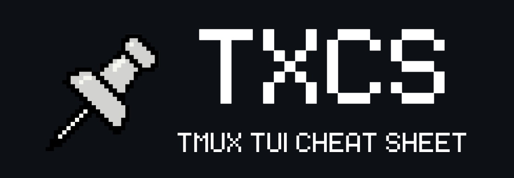

<a id="readme-top"></a>

<!-- PROJECT SHIELDS -->
[![Contributors][contributors-shield]][contributors-url]
[![Forks][forks-shield]][forks-url]
[![Stargazers][stars-shield]][stars-url]
[![Issues][issues-shield]][issues-url]
[![License][license-shield]][license-url]

<br />
<div align="center">

  <div align="center">
    
  </div>

  <p align="center">
    A keyboard-driven TUI cheat sheet for tmux commands — stay in your terminal, stop switching to the browser.
    <br />
    <a href="https://github.com/whitegunrose/TMUX-Terminal-Cheat-Sheet/wiki"><strong>Explore the docs »</strong></a>
    <br />
    <br />
    <a href="https://github.com/whitegunrose/TMUX-Terminal-Cheat-Sheet/issues/new?labels=bug&template=bug-report.md">Report Bug</a>
    ·
    <a href="https://github.com/whitegunrose/TMUX-Terminal-Cheat-Sheet/issues/new?labels=enhancement&template=feature-request.md">Request Feature</a>
  </p>
</div>

---

## Table of Contents

1. [About The Project](#about-the-project)
   - [Built With](#built-with)
2. [Getting Started](#getting-started)
   - [Prerequisites](#prerequisites)
   - [Installation](#installation)
3. [Usage](#usage)
4. [Roadmap](#roadmap)
5. [Contributing](#contributing)
6. [License](#license)
7. [Contact](#contact)
8. [Acknowledgments](#acknowledgments)

---
<div align="center">
  
</div>

---

<!--  -->

## About The Project

TMUX Terminal Cheat Sheet is a keyboard-driven Terminal User Interface (TUI) application written in Go that gives you instant access to tmux commands — without ever leaving your terminal. No more alt-tabbing to a browser, no more broken focus. Every session prefix, pane shortcut, and window command is one keystroke away.

**Why TMUX Cheat Sheet?**

- 🖥️ Lives entirely in your terminal — no browser, no GUI, no distractions
- ⚡ Zero startup overhead, so it never disrupts your workflow
- 📋 Organizes tmux commands by category for fast, scannable lookup
- ⌨️ Fully keyboard-driven navigation — your mouse can stay put

<p align="right">(<a href="#readme-top">back to top</a>)</p>

### Built With

[![Go][Go-badge]][Go-url]
[![Bubbletea][Bubbletea-badge]][Bubbletea-url]
[![Bubbles][Bubbles-badge]][Bubbles-url]
[![Lipgloss][Lipgloss-badge]][Lipgloss-url]

> TMUX Terminal Cheat Sheet is 100% Go. The TUI layer is powered by [Bubbletea](https://github.com/charmbracelet/bubbletea) — an Elm-inspired framework for terminal apps — with UI components from [Bubbles](https://github.com/charmbracelet/bubbles) and styling from [Lipgloss](https://github.com/charmbracelet/lipgloss), both part of the [Charm](https://charm.sh) ecosystem.

<p align="right">(<a href="#readme-top">back to top</a>)</p>

---

## Getting Started

Follow the steps below to get the TMUX Cheat Sheet running on your local machine.

### Prerequisites

- **Go 1.24+** — [Install Go](https://go.dev/dl/)

  ```sh
  go version   # verify installation
  ```

### Installation

1. Clone the repository

   ```sh
   git clone https://github.com/whitegunrose/TMUX-Terminal-Cheat-Sheet.git
   ```

2. Navigate into the project directory

   ```sh
   cd TMUX-Terminal-Cheat-Sheet
   ```

3. Build the application

   ```sh
   go build -o tmux-cheat-sheet ./cmd/tmux-cheat-sheet
   ```

4. Run the cheat sheet

   ```sh
   ./tmux-cheat-sheet
   ```

   Or run it directly without building:

   ```sh
   go run ./cmd/tmux-cheat-sheet
   ```

5. *(Optional)* Move the binary to your `PATH` for system-wide access

   ```sh
   mv tmux-cheat-sheet /usr/local/bin/tmux-cheat-sheet
   ```

<p align="right">(<a href="#readme-top">back to top</a>)</p>

---

## Usage

Launch the cheat sheet from any terminal and use the keyboard to navigate:

```
tmux-cheat-sheet
```

| Key             | Action                    |
|-----------------|---------------------------|
| `j` / `k`      | Navigate between commands |
| `h` / `l`      | Switch between categories |
| `q` / `Ctrl+C` | Quit                      |
<!-- | `/`             | Search / filter commands  | -->

> For full keybinding reference, see the [documentation](https://github.com/whitegunrose/TMUX-Terminal-Cheat-Sheet/wiki).

<p align="right">(<a href="#readme-top">back to top</a>)</p>

---

## Roadmap

- [x] Core TUI shell and navigation
- [x] Full tmux command reference organized by category
- [x] Lipgloss-styled layout and theming
- [ ] Fuzzy search across all commands
- [ ] Custom keybinding support
- [ ] Cross-platform binary releases (Linux, macOS, Windows)

See the [open issues](https://github.com/whitegunrose/TMUX-Terminal-Cheat-Sheet/issues) for the full list of proposed features and known bugs.

<p align="right">(<a href="#readme-top">back to top</a>)</p>

---

## Contributing

Contributions are what make the open-source community such an amazing place to learn, grow, and build. Any contributions you make are **greatly appreciated**.

If you have a suggestion that would improve this project, please fork the repo and open a pull request, or open an issue with the tag `enhancement`. Don't forget to give the project a ⭐ — it means a lot!

1. Fork the project
2. Create your feature branch

   ```sh
   git checkout -b feature/AmazingFeature
   ```

3. Commit your changes

   ```sh
   git commit -m 'Add some AmazingFeature'
   ```

4. Push to the branch

   ```sh
   git push origin feature/AmazingFeature
   ```

5. Open a Pull Request

<p align="right">(<a href="#readme-top">back to top</a>)</p>

---

## License

Distributed under the MIT License. See `LICENSE` for more information.

<p align="right">(<a href="#readme-top">back to top</a>)</p>

---

<!-- ## Contact -->

<!-- **whitegunrose** — [@whitegunrose](https://github.com/whitegunrose) -->

<!-- Project Link: [https://github.com/whitegunrose/TMUX-Terminal-Cheat-Sheet](https://github.com/whitegunrose/TMUX-Terminal-Cheat-Sheet) -->

<!-- <p align="right">(<a href="#readme-top">back to top</a>)</p> -->

<!-- --- -->

## Acknowledgments

Resources and tools that made this project possible:

- [Bubbletea](https://github.com/charmbracelet/bubbletea) — Elm-inspired TUI framework for Go
- [Bubbles](https://github.com/charmbracelet/bubbles) — Reusable TUI components for Bubbletea
- [Lipgloss](https://github.com/charmbracelet/lipgloss) — Style definitions and layout for terminal UIs
- [Charm](https://charm.sh) — The ecosystem behind all three libraries above
- [Go Documentation](https://go.dev/doc/)
<!-- - [Best-README-Template](https://github.com/othneildrew/Best-README-Template) — README structure inspiration -->
<!-- - [Shields.io](https://shields.io) — Badge generation -->
<!-- - [Choose an Open Source License](https://choosealicense.com) -->

<p align="right">(<a href="#readme-top">back to top</a>)</p>

---

<!-- MARKDOWN LINKS & BADGES -->
[contributors-shield]: https://img.shields.io/github/contributors/whitegunrose/TMUX-Terminal-Cheat-Sheet.svg?style=for-the-badge
[contributors-url]: https://github.com/whitegunrose/TMUX-Terminal-Cheat-Sheet/graphs/contributors
[forks-shield]: https://img.shields.io/github/forks/whitegunrose/TMUX-Terminal-Cheat-Sheet.svg?style=for-the-badge
[forks-url]: https://github.com/whitegunrose/TMUX-Terminal-Cheat-Sheet/network/members
[stars-shield]: https://img.shields.io/github/stars/whitegunrose/TMUX-Terminal-Cheat-Sheet.svg?style=for-the-badge
[stars-url]: https://github.com/whitegunrose/TMUX-Terminal-Cheat-Sheet/stargazers
[issues-shield]: https://img.shields.io/github/issues/whitegunrose/TMUX-Terminal-Cheat-Sheet.svg?style=for-the-badge
[issues-url]: https://github.com/whitegunrose/TMUX-Terminal-Cheat-Sheet/issues
[license-shield]: https://img.shields.io/github/license/whitegunrose/TMUX-Terminal-Cheat-Sheet.svg?style=for-the-badge
[license-url]: https://github.com/whitegunrose/TMUX-Terminal-Cheat-Sheet/blob/main/LICENSE
[Go-badge]: https://img.shields.io/badge/Go-00ADD8?style=for-the-badge&logo=go&logoColor=white
[Go-url]: https://go.dev/
[Bubbletea-badge]: https://img.shields.io/badge/Bubbletea-EE6FF8?style=for-the-badge&logo=go&logoColor=white
[Bubbletea-url]: https://github.com/charmbracelet/bubbletea
[Bubbles-badge]: https://img.shields.io/badge/Bubbles-EE6FF8?style=for-the-badge&logo=go&logoColor=white
[Bubbles-url]: https://github.com/charmbracelet/bubbles
[Lipgloss-badge]: https://img.shields.io/badge/Lipgloss-EE6FF8?style=for-the-badge&logo=go&logoColor=white
[Lipgloss-url]: https://github.com/charmbracelet/lipgloss
